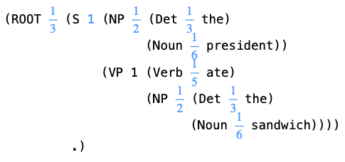
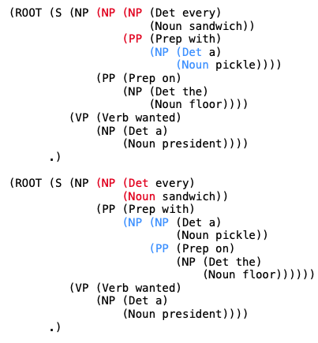

## 1

### 1.4.1

(1) a sandwich in every floor under every delicious delicious floor under a perplexed chief of staff understood the sandwich under every president !

(2) the president pickled every delicious pickled floor .

(3) is it true that the pickle with the delicious chief of staff in every sandwich in every delicious president kissed a sandwich ?

(4) is it true that every president understood a sandwich under every pickle ?

(5) a sandwich ate every floor !

(6) is it true that the sandwich kissed every fine floor ?

(7) is it true that a pickle on every floor under every floor in every delicious floor in the sandwich with every president with a floor under every chief of staff with the sandwich with a sandwich with the floor on the pickle with a floor under every delicious floor under every chief of staff with a floor with every president in a floor in a chief of staff on every sandwich on every president under a pickle under the sandwich under a fine president with a pickle under every chief of staff in every chief of staff under a floor with every floor in every pickle with a sandwich in every pickled president in every perplexed floor on the floor with every floor in every floor in the floor on every president with a pickled president under every chief of staff in every fine pickle on every president understood every pickle ?

(8) is it true that every fine floor wanted the chief of staff ?

(9) the pickle ate a chief of staff .

(10) the floor under every pickled sandwich with a chief of staff ate a chief of staff !

### 1.4.2

(1)
```
(ROOT (S (NP (Det every)
             (Noun chief
                   of
                   staff))
         (VP (Verb wanted)
             (NP (NP (Det the)
                     (Noun president))
                 (PP (Prep under)
                     (NP (NP (Det a)
                             (Noun chief
                                   of
                                   staff))
                         (PP (Prep with)
                             (NP (NP (NP (Det every)
                                         (Noun president))
                                     (PP (Prep with)
                                         (NP (Det the)
                                             (Noun president))))
                                 (PP (Prep on)
                                     (NP (Det a)
                                         (Noun floor))))))))))
      .)
```

(2)
```
(ROOT is
      it
      true
      that
      (S (NP (Det the)
             (Noun floor))
         (VP (Verb ate)
             (NP (Det the)
                 (Noun chief
                       of
                       staff))))
      ?)
```

### 1.4.2

(1)
```
(ROOT (S (NP (Det every)
             (Noun president))
         ...)
      !)
```
(2)
```
(ROOT is
      it
      true
      that
      (S (NP (NP (NP ...
                     ...)
                 ...)
             ...)
         ...)
      ?)
```

## 2

### 2.1

1. NP -> NP PP and Noun -> Adj Noun. These two rules result in infinite (or max_expansion_num in our case) recursion, which leads to long sentences.
2. The probability to have n adj. for a noun is $(1/6)^n$.
3. The weight for NP -> NP PP should be smaller and that for Noun -> Adj Noun should be larger.
4. Lessen the weight for Det. -> every. Because there is less *every* for determiner in regular sentences than *a* and *the*.
5. every chief of staff with a fine delicious perplexed pickle pickled every delicious floor !
   every fine floor kissed the president .
   the pickle kissed a perplexed pickled pickle with a pickle !
   is it true that a floor understood a fine fine pickled pickle ?
   the delicious perplexed sandwich kissed every floor on the pickle in a floor with a fine pickled fine floor on the pickle on a president with the sandwich on a sandwich .
   a floor understood a sandwich .
   is it true that every pickle ate every chief of staff under a chief of staff on the floor ?
   is it true that every pickled pickled delicious floor ate a floor ?
   every perplexed fine president kissed a floor .
   is it true that a perplexed delicious president pickled the floor ?

### 2.3

6. Add one rule in Root for emphasizing. Add one rule in S for clause to be the subject of one sentence. Add one rule for clause phrases. Add one rule for intransitive verbs. Add one rule for prepositional phrases to describing verbs. Add conjunctions to be used. Add adjective phrases to be described by adverbs (*very*). Add rules for verbs which can be followed by a clause.
7.  Sally on the delicious sandwich or every sandwich or Sally sighed .
   that every floor pickled a desk on a pickled perplexed president with the perplexed desk wanted Sally or a fine floor .
   it perplexed Sally that Sally thought that the fine chief of staff sighed and ate Sally and sighed and pickled a pickle on Sally and thought that a chief of staff sighed .
   the perplexed president sighed .
   every desk perplexed a floor on the delicious fine sandwich .
   Sally sighed and ate a very fine pickled pickled chief of staff .
   a floor sighed and sighed .
   the pickle thought that Sally ate the sandwich .
   a pickled desk and a desk wanted that Sally sighed in every fine pickle .
   the sandwich kissed the pickled chief of staff .
   
   
## 3
### 3.3.1

(a)
```
(ROOT (S (NP (NP (NP (Det every)
                     (Noun sandwich))
                 (PP (Prep with)
                     (NP (Det a)
                         (Noun pickle))))
             (PP (Prep on)
                 (NP (Det the)
                     (Noun floor))))
         (VP (Verb wanted)
             (NP (Det a)
                 (Noun president))))
      .)
```
(b) 
Yes, different derivations have different meaning. 
The provided derivation indicates that the pickle is on the floor, while above derivation indicates that the sandwich is on the floor.

### 3.3.2

When using grammar2.gr, the parse recover the original derivation at most of the time. It is because we reduced the weight of rule **NP -> NP PP** from 1 to 0.2, causing less confusion.

When using grammar3.gr the parse more often misunderstands sentences and finds alternative derivations. It is mostly because we added more rules, such as **NP -> NP and NP** and **Noun -> AdjP Noun**, causing more confusion.

### 3.3.3
5 ways.
```
{ every sandwich } 
{ with [ a pickle ] 
       [ on ( the floor ) 
            ( under the chief of staff ) ] }
```
```
{ every sandwich } 
{ with [ ( a pickle ) 
         ( on the floor ) ] 
       [ under the chief of staff ] }
```
```
{ [ every sandwich]
  [ with a pickle] }
{on [ the floor ] 
    [ under the chief of staff ] }
```
```
{ [ every sandwich] 
  [ with ( a pickle ) 
         ( on the floor ) ] } 
{ under the chief of staff }
```
```
{ [ ( every sandwich ) 
    ( with a pickle ) ]
  [ on the floor ] } 
{ under the chief of staff }
```
### 3.3.4

When using grammar.gr, the more consecutive rules **NP -> NP PP**
**PP -> Prep NP** a sentence has, the more different parses it has.

When using grammar3.gr, the more rules **NP -> NP PP**, **PP -> Prep NP**, **Noun -> AdjP Noun**,**VP -> VP PP**,**VP -> VP and VP**
 a sentence has, the more different parses it has.
 
### 3.3.5

（a) 
It is small because it’s the probability of generating a sentence based on this derivation among all possible derivations of all possible sentences.
The probabilities of the next chosen rule at every position.


They are equal because this sentence has only 1 way of parsing.

&nbsp;&nbsp; p(best_parse, sentence)  =  p(sentence)  *  p(best_parse)  /  sum of p(ith_parse)

This sentence has only 1 way of parsing, so 

&nbsp;&nbsp; p(best_parse, sentence) = p(sentence)

&nbsp;&nbsp; p(best_parse | sentence)  =  p(best_parse , sentence)  /  p(sentence)  =  1

(b)

0.5 is the probability of this derivation given this sentence. It means that this sentence has 2 ways of parsing.

It is exactly 0.5 because the probability of two derivations are equal. As shown below, the differences of derivations are colored with red and blue. They have the same probabilities of rule **NP -> Det Noun** and **NP -> NP PP** at different positions, so their overall probabilities are exactly the same.



(c) 

18 : number of words

-43.833 : log_2(p(sentence1))+log_2(p(sentence2))=-14.246 + -29.587 = -43.833

2.435 : 43.833/18 

(d)
perplexity = 2 ^ (cross-entropy) = 5.408

(e)
The parsing results are:
```
the president ate the sandwich .
 (ROOT (S (NP (Det the) (Noun president)) (VP (Verb ate) (NP (Det the) (Noun sandwich)))) .)
# P(best_parse) = 5.144e-05
# P(sentence) = 5.144e-05
# P(best_parse | sentence) = 1.000

the president ate .
failure
# P(best_parse) = nan
# P(sentence) = 0.000e+00
# P(best_parse | sentence) = nan
```
The possibility of the second sentence is 0.

Cross-entropy = -(log_2(p(sentence1))+log_2(p(sentence2)))/18= (14.246 + inf)/18 = inf

The second parsing failed because there’s no rule **S -> NP Verb**. This model failed to predict this corpus, so it is not able to compress it properly.

### 3.3.6

(a) grammar2: 2.147 bits per word.
```
python3 randsent.py -g grammar2.gr -n 1000 | ./parse -g grammar2.gr -P
# cross-entropy = 2.147 bits = -(-26836.271 log-prob. / 12501 words)
```
(b) grammar3: =1.278 bits per word.

The entropy of grammar2 is higher than that of grammar3. It is probably because grammar3 has more rules that can generate repeating words, such as **Noun -> AdjP Noun** and **NP -> NP and NP**.
```
python3 randsent.py -g grammar3.gr -n 1000 | ./parse -g grammar3.gr -P
# cross-entropy = 1.278 bits = -(-21458.033 log-prob. / 18266 words)
```
(c) Some sentences have "..." and cause parsing failure. The probability is 0 and cross-entropy is inf. It is because the original rule **NP -> NP PP** with high weight makes generated sentences exceed max expansion limit.

3.3.7
```
python3 randsent.py -g grammar2.gr -n 1000 > corpus2.txt
```
```
cat corpus2.txt | ./parse -g grammar.gr -P
# cross-entropy = 2.402 bits = -(-28761.075 log-prob. / 11974 words)
```
```
cat corpus2.txt | ./parse -g grammar2.gr -P
# cross-entropy = 2.142 bits = -(-25642.947 log-prob. / 11974 words)
```
```
cat corpus2.txt | ./parse -g grammar3.gr -P
# cross-entropy = 2.708 bits = -(-30946.938 log-prob. / 11974 words)
```
The entropy of grammar2 on corpus2 is the lower. It is because for each sentence generated by grammar2, the possibility of it in grammar2 should be higher. The cross-entropy is negatively related to the sum of these possibilities, so grammar2’s entropy is lower than others’.

## 4
### 4.1
1. I chose the fourth and the fifth phenomena to implement.
The fourth phenomenon is to generate “I wonder” sentences with so-called embedded questions. Since “I wonder” sentences contain wh-word and following embedded questions, I create a phrase called wh-word phrase. 

The fifth phenomenon is use singular and plural forms of verb to generate sentences. So, we set VerbT as verb with s (singular forms) and Verb_base as verb without s (plural forms).And NP_plu stands for noun phrase in plural forms, NP_sin stands for noun phrase in singular forms, VP_plu stands for verb phrase in plural forms and VP_sin stands for verb phrase in singular forms. 
